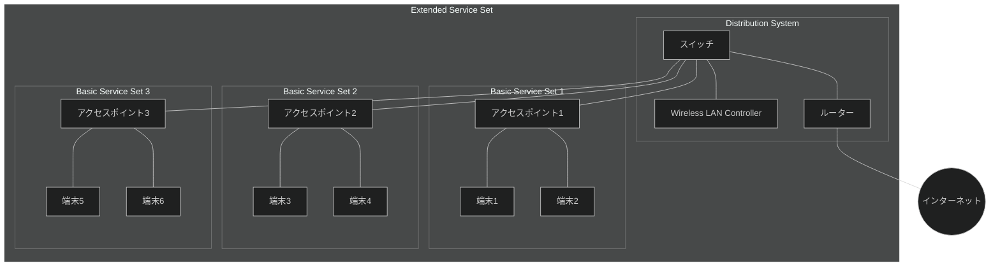
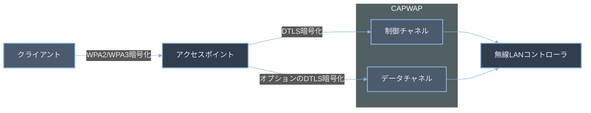

## 双方向通信

WLAN（無線LAN）は電波を利用して通信を行うため配線は不要。電波を利用するため、半二重通信で通信を行っている。

- **全二重通信（Full-duplex）:**
    - 定義:データを同時に双方向で送受信できる通信方式
    - 特徴:
        - 両方向で同時にデータの送受信が可能
        - 通信効率が高い
        - より複雑な通信機器が必要
    - 例:
        - 電話の通信：両者が同時に話し、聞くことができる
        - 光ファイバー通信：異なる波長を使用して双方向同時通信を実現している
        - イーサネット（全二重モード）：送信と受信に別々の回線を使用
- **半二重通信（Half-duplex）:**
    - 定義：双方向の通信が可能だが、一方向のみの通信となる方式
    - 特徴：
        - 一度に一方向のみ通信
        - 通信方向の切り替えが必要
        - 全二重通信と比べて効率は劣るが、危機は比較的シンプルになる
    - 例：
        - トランシーバー（無線機）：交互に送受信を切り替えて通信
        - 初期のイーサネット：同一の伝送路を送受信で共有
        - 無線LAN（Wi-Fi）：基本的には半二重通信だが、現代の技術によって擬似的に全二重通信を実現している
        - 電波や赤外線を使った双方向通信は、基本的に半二重通信になる

### 通信ケーブルと双方向通信

コンピュータネットワークにおいて、使用する通信ケーブルの種類によって通信方式が変わってくる。

**ツイストペアケーブル**

- イーサネットで広く使用される
    - 初期のイーサネット（10BASE-T, 100BASE-TX）：**半二重通信**
    - 現在のイーサネット（1000BASE-T以降）：**全二重通信が一般的**
        - 同じケーブルでも、ネットワーク機器の設定によって、半二重/全二重の切り替えが可能な場合がある

**光ファイバーケーブル**

- 長距離、高速通信に使用されるケーブル
    - **基本的に全二重通信**
    - 異なる波長を利用して双方向同時通信を実現
    - 例：
        - 1000BASE-SX、10GBASE-SR など

**同軸ケーブル**

- かつてのイーサネット（10BASE-2、10BASE-5）で使用
    - **半二重通信**
    - 1本のケーブルを複数デバイスで共有
    - 現在のコンピュータネットワークでは利用されない

**USBケーブル**

- 半二重通信（USB2.0まで）、全二重通信（USB3.0以降）
- コンピュータと周辺機器の接続に利用される

**シリアルケーブル**

*RS-232*

- RS-232、RS-422 であれば基本的には全二重通信
- RS-485 は RS-422 の上位規格
    - 接続台数が多くなるように改善された
    - 全二重通信と半二重通信の二つがある
        - 一般的に半二重通信の方を指す

## 通信の衝突回避

電波を使って通信を行う無線 LAN は半二重通信となる。半二重通信は通信の衝突の可能性があるため、CSMA/CA (Carrier Sense Multiple Access/Collision Avoidance) で衝突を制御している。

CSMA/CA は L2（データリンク層）で利用されている。送受信するフレームは電波に乗っているため、他のクライアント（PC など）でも観測できる。しかし、フレーム（ACK を含む）にはヘッダーがあり、送信元と宛先のMACアドレスが含まれていることから、自分宛てではないフレームは通常無視される。

この方式は Nintendo DS などで利用するような端末同士の（AP を介さない）通信（**アドホックモード**）でも利用される。

AP（通信を制御している機器）が中心的な役割を果たす、**インフラストラクチャモード**（AP を介して通信する方式）でも CSMA/CA のメカニズム自体、すべての端末で動作する。

確認の流れ：
  1. 搬送波感知（Carrier Sense）：通信を開始する前に、一度受信を試みることで現在通信をしている端末が他にあるか確認する
  2. 多重アクセス（Multiple Access）：複数の端末は同じ回線を共用し、他社が通信をしていなければ自分の通信を開始する
  3. 衝突回避（Collision Avoidance）：
    a. Carrier Sense の段階で通信中の端末が存在した場合、通信終了と同時に送信を試みると衝突する可能性が高い
    b. 他の端末の送信完了を検知すると、ランダムな時間を待機し、 受信側へデータを送信する
    c. 送信側が ACK を受信しない場合、衝突が発生したと判断し、再送信を試みる

以上をシンプルにまとめる：
  1. 利用状況の確認
  2. ランダムな時間を待機して送信側端末 → 受信側端末へデータを転送
  3. 受信側端末から ACK フレームを送信

### 隠れ端末問題

電波の状況によってクライアントと AP 間でお互いの端末を認識できない問題が発生することがある。

これが「隠れ端末問題」である。

お互いの端末を認識できないと、CSMA/CA による衝突（コリジョン）回避の仕組みが動作しないため、通信の衝突が発生してしまう。

### CSMA/CA with RTS/CTS

これは CSMA/CA に RTS/CTS 制御を付け加えた方式である。これによって**隠れ端末問題**へ対応できる。

RTS/CTS 制御は通信を開始する前に、AP へ「通信の許可」を得る方式である。通信の許可は、すべての端末へ通知されるため、許可を得たクライアントのみ通信を開始でき、他のクライアントは待機状態になる。

CSMA/CA with RTS/CTS の仕組み：
  1. クライアントから AP へ RTS（送信要求）フレームを送信
  2. AP からすべてのクライアントへ CTS（送信許可）フレームの応答
  3. 通信を許可されたクライアント以外は待機する
  4. RTS/CTS のやり取りが成功した送信元クライアントと AP が通信をする
  5. AP が データ受信後、AP からすべてのクライアントへ ACK を送信

## WLAN の構成範囲

- BSS（Basic Service Set）
    - 単一の AP とそれと通信するクライアントで構成される
    - BSSID は AP の MAC アドレスが利用されることが多い
- DS（Distribution System）
    - 複数の BSS を相互接続し、ESS を形成するためのシステム
    - 主にスイッチ、ルーター等の有線ネットワーク機器で構成される
    - 異なる BSS 間のデータ転送を担当
    - AP 間のローミングをサポートし、シームレスな移動を可能にする
    - ESS 全体のトラフィック管理と制御を行う
- ESS（Extended Service Set）
    - 複数の BSS で構成されるネットワーク
    - ESSID（または単に SSID）は ESS 全体を識別するために使用される

参考: [Wireless LAN 802.11 Service Sets](https://networklessons.com/cisco/ccna-200-301/wireless-lan-802-11-service-sets)

## ビーコン

ビーコンは WLAN ネットワークにおいて重要な役割を果たすフレーム（データパケット）である。

1. 定義：ビーコンは、AP が定期的に Broadcast で送信する管理フレームの一種
2. 目的：
   a. ネットワークの存在を告知する
   b. クライアントが AP を発見し、接続するのを助ける
3. 送信頻度：通常、約100ms毎にビーコンを送信する。設定可能。
4. 含まれる情報：
  a. SSID
  b. タイムスタンプ（`MAC timestamp: 512815407` みたいな）
  c. サポートされている通信速度
  d. チャネル情報などなど

**Tips: Wireshark でキャプチャする**

- 参考: [無線LAN(IEEE802.11フレーム)を見てみよう](https://qiita.com/orikaito/items/e05b89476a5de40742dd)
- `wlan.ssid == "xyz" && wlan.fc.type_subtype==8` でフィルタする
  - https://www.cwnp.com/beaconinterval/

## セキュリティ

無線LANのセキュリティ基盤はデータの暗号化である。電波は第三者にも伝わるが、暗号化することで内容を解釈できないようにする。

| セキュリティ規格 | 登場時期  | 認証方式             | 暗号化方式             | アルゴリズム       | 安全性評価                   |
|------------------|------------|----------------------|------------------------|--------------------|------------------------------|
| WEP              | 1997年     | 共有キー認証、オープン認証 | RC4                     | 64/128ビット       | × |
| WPA              | 2003年     | PSK（Pre-Shared Key）、802.1X | TKIP                   | RC4                | × |
| WPA2             | 2004年     | PSK、802.1X          | CCMP (AESベース)        | AES                | ⚪︎ |
| WPA3             | 2018年     | SAE（Simultaneous Authentication of Equals）、802.1X | GCMP-256           | AES-256、BIP-GMAC-256 | ◎ |
| WPA3-Enterprise  | 2018年     | 802.1X               | GCMP-256、CCMP-128      | AES-256、AES-128   | ◎ |

- WEP: 低い。容易に破られることが判明
- WPA: WEPよりも改善されたが、RC4 の脆弱性が残る
- WPA2: 高い。AES暗号を使用し、WPAの脆弱性を克服
- WPA3: 非常に高い。パスワードクラックに対する耐性が強化され、WPA2の弱点が改善
- WPA3-Enterprise: 非常に高い。エンタープライズ環境での使用に最適化

**認証**

WLAN ネットワークへ参加するために認証を設定できる。クライアントの認証方式は2種類ある。

- パスフレーズを利用するパーソナルモード
    - 全員同じパスワードになる
- RADIUS サーバーを利用するエンタープライズモード
    - ユーザー名とパスワードを RADIUS サーバーで管理でき、ユーザーごとに認証情報を設定できる

認証の役割として以下の3つが登場する。

- 認証を受けるクライアントを**サプリカント**
- クライアントと認証サーバーを仲介する**認証装置**
- 認証情報の管理、認証を行う**認証サーバー**

## ローミング

電波の状況に応じて自動で接続する AP を電波の弱い AP から強い AP へ切り替える技術。ローミングは以下の条件が揃っている必要がある。

- SSID（ESSID）同じであること
- AP 間のチャネルの干渉が少ないこと
- AP 同士のセキュリティ設定が同じであること

## 集中管理

**自立型**

AP 毎に設定を行う。Cisco ではこのタイプの AP を Autonomous AP と呼んでいる。このタイプは AP 自身が設定や、制御情報を持っている。

個別で設定が必要なため、小規模オフィスや家庭、特定の場所に限られたネットワーク環境で主に利用される。

**集中管理型**

AP を複数用意する環境にて、AP 個別に同じ設定していくのは辛くなってくる。そこで WLAN コントローラ（WLC）を利用して一括で設定、管理を行う。

Cisco では WLC によって集中管理される AP を Lightweight AP としている。この方式では、AP 自体は最低限の機能しか持たず、ネットワークのほとんどの設定や制御は WLC に委ねられている。

大規模なキャンパスネットワークや企業のネットワークで利用される。

### CAPWAP（Cisco 開発）

AP と WLC 間の通信を行うためのプロトコル。CAPWAP トンネルを作成し以下のデータをやり取りする。

- 制御チャネル：
    - WLC が AP の設定や管理する情報を送受信する、つまり AP を制御するための情報
    - UDP の 5246 番ポートを利用
- データチャネル：
    - 実際のユーザーデータの転送。転送は AP が行う
    - UDP の 5247 番ポートを利用

CAPWAP は DTLS（Datagram Transport Layer Security）を使用して、WLC と AP 間の通信を暗号化して、セキュリティを確保する。しかし、基本的にデータチャネル内のデータは暗号化されない[^1]が、WLC の機種によって DTLS を利用して暗号化を行うこともできる。

[^1]: クライアントと AP 間のデータは暗号化されているため、CAPWAP のデータチャネルで暗号化しなくても十分とのこと。

### FlexConnect（Cisco 開発）

Lightweight AP は WLC の管理下に置かれるため、通常 WLC との接続が失われると、CAPWAP トンネルも失われるため、AP が止まってしまう。

しかし、FlexConnect を利用すると WLC との接続が失われても AP 自身がインターネットや地域のリソースにアクセスできる状態を維持してくれるため、障害時のネットワーク可用性を高めたい場合などで利用される
